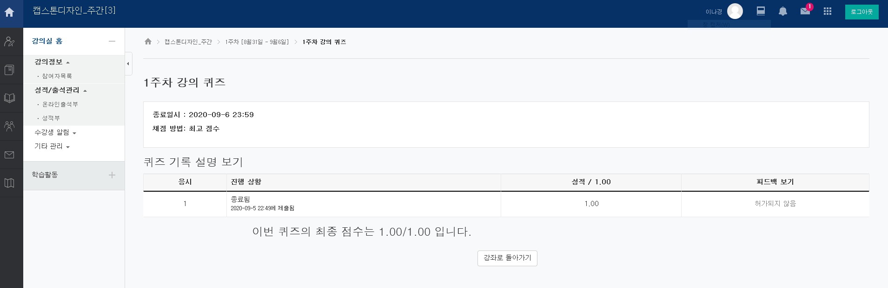
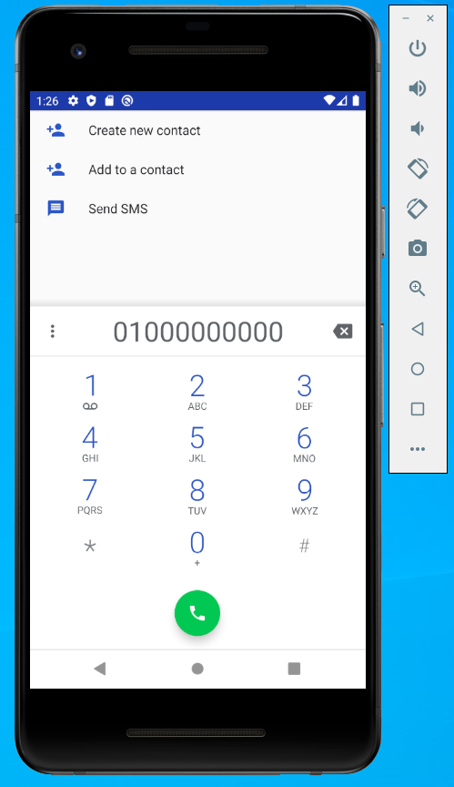
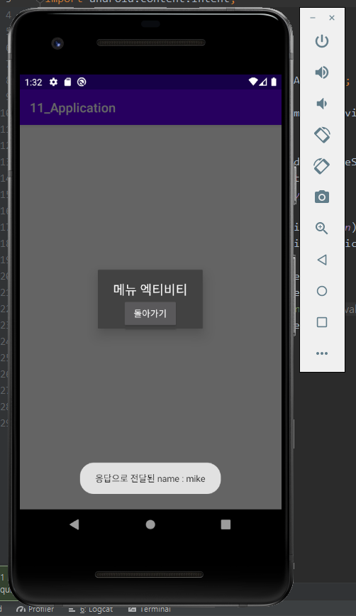

# 19173050 이나경

## 1주차 과제

## 2주차 과제

## 3주차 과제

## 4주차 과제

 - 아이디어 명 : 모든 브랜드를 한 공간에서 볼 수 있는 앱
 - 아이디어 내용 : 브랜드 제품과 소호 제품을 한 공간에서 다 같이 볼 수 있으며 처음 나오는 페이지는 브랜드를 정렬해 놓은 페이지이다. 원하는 브랜드를 클릭하거나 원하는 제품, 브랜드를 검색해서 볼 수도 있다. 조회 수와 신상품 순으로 정열 된다. 원하는 제품을 누르면 그 제품의 공식 홈페이지나 판매 페이지로 이동해 상세페이지로 이동해서 상품을 구매할 수도 있다.

## 7주차 과제

## 9주차 과제

## 10주차 과제

## 11주차 과제

